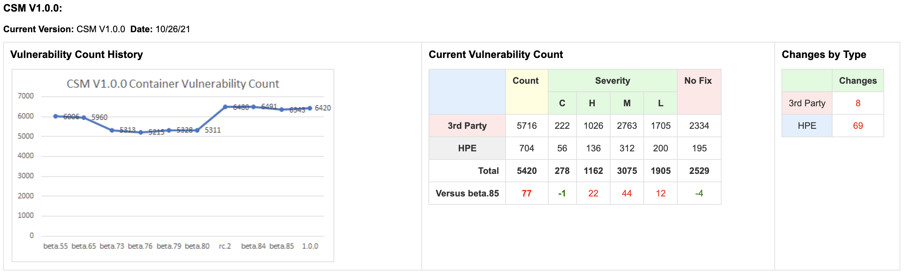
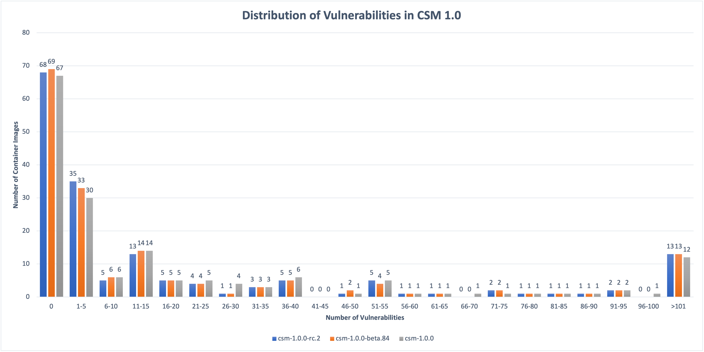
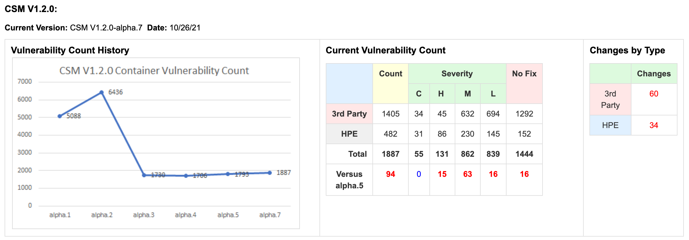
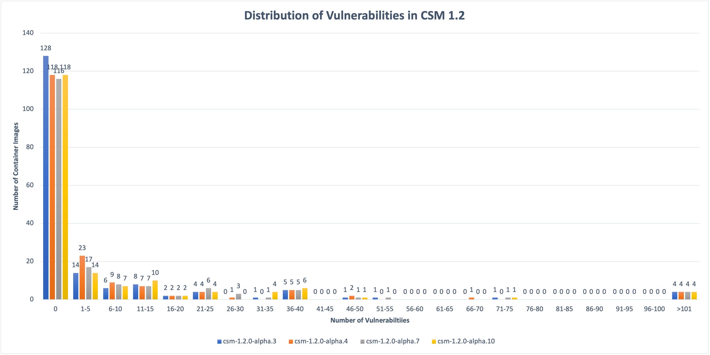

# 28 Oct 2021

## Status

### Container Image Vulnerabilities

CSM 1.0.0 was released on 22 Oct and CSM 1.2.0-alpha.10 was built today. The CVE
metrics are below, and show no significant variance since the last update.

Steve Johnson asked specifically about CVEs in various container images. I’ve
attached the Snyk results for CSM 1.0.0 and 1.2.0-alpha.10 for comparison, but
here’s a summary for the images shipped in CSM 1.0.0:

| CSM 1.0.0 Image  | Tag     | Total Vulns | Critical | High | Medium | Low | CVEs |
| ---------------  | ---     | ----------- | -------- | ---- | ------ | --- | ---- |
| cray-dhcp-kea    | 0.7.8   | 3 | 1 | 1 | 1 | 0 | CVE-2021-22945 CVE-2021-22946 CVE-2021-22947 |
| cray-dns-unbound | 0.4.8   | 0 | 0 | 0 | 0 | 0 | |
| cray-tftpd       | 1.4.23  | 0 | 0 | 0 | 0 | 0 | |
| spire-server     | 0.12.2  | 0 | 0 | 0 | 0 | 0 | |
| cray-hbtd        | 1.10.6  | 3 | 1 | 1 | 1 | 0 | CVE-2021-22945 CVE-2021-22946 CVE-2021-22947 |
| cray-smd         | 1.28.25 | 0 | 0 | 0 | 0 | 0 | |
| cray-hmnfd       | 1.8.5   | 3 | 1 | 1 | 1 | 0 | CVE-2021-22945 CVE-2021-22946 CVE-2021-22947 |
| cray-bss         | 1.7.7   | 3 | 1 | 1 | 1 | 0 | CVE-2021-22945 CVE-2021-22946 CVE-2021-22947 |
| cray-cfs         | 1.6.35  | 3 | 1 | 1 | 1 | 0 | CVE-2021-22945 CVE-2021-22946 CVE-2021-22947 |

As you can see, in CSM 1.0 those images with vulnerabilities, all have the same
CVEs against curl: CVE-2021-22945, CVE-2021-22946, CVE-2021-22947. However, as
we can see with the updated images in CSM 1.2, those vulnerabilities are
resolved:

| CSM 1.2.0-alpha.10 Image | Tag    | Total Vulns |
| ------------------------ | ---    | ----------- |
| cray-dhcp-kea            | 0.9.8  | 0 |
| cray-dns-unbound         | 0.6.9  | 0 |
| cray-tftpd               | 1.6.82 | 0 |
| spire-server             | 0.12.2 | 0 |
| cray-hbtd                | 1.12.4 | 0 |
| cray-smd                 | 1.31.0 | 0 |
| cray-hmnfd               | 1.9.7  | 0 |
| cray-bss                 | 1.9.10 | 0 |
| cray-cfs                 | 1.8.83 | 0 |

In these specific cases, it may be possible for us to rebuild these CSM 1.0.0
images such that a future patch (e.g., 1.0.1) would contain updated images at
the same tag; however, we do not yet have automation in place that periodically
rebuilds all our images. (But it’s in the works.)

### API Least Privileges

We have a resolution for V26: Any user can set the SoftwareStatus for any
component. The DVS team will update their client to use a new SMD endpoint that
authorizes changes for a specific xname only when the client is authenticated
from that xname.

As far as CSM components, what remains is the set of vulnerabilities associated
with the access token in ipxe.efi binary and the SPIRE join token delivered in
BSS boot parameters. Although we are planning to support TPM based node
attestation for NCNs (when trusted boot is delivered), we learned this past week
that TPMs on compute nodes will not have the necessary support prior to Parry
Peak, which is not scheduled for GA until Q3 CY2023. We have not yet prioritized
work against the proposal to use ACME to establish “boot certs” for use with
SPIRE’s x509pop plugin.

### Non-root Containers

Examination of OPA gatekeeper policy violations from CSM 1.0.0 test system is
ongoing. _Initial assessment:_ only policy without violations is “selinux”,
which we don’t have enabled. _BLUF:_ We’ve got work to do to breakdown the
violations and prioritize fixes. Expect some/many policies to still be in
`dry-run` mode for CSM 1.2. Priority is to resolve violations of `users` and
`capabilities` policies. Prototype changes to OPA gatekeeper `users` and
`capabilities` policies to support exemptions for specific container images are
available, see https://github.com/Cray-HPE/cray-opa-gatekeeper/pull/4.
Investigating additional filters to match exemptions for specific chart
releases.

### Pen Testing

We are still pursuing an outside firm to complete a red-team evaluation. This
week we received recommendations from HPE Product Security Office regarding four
outside firms that have performed red-team evaluations for HPE in the past.
