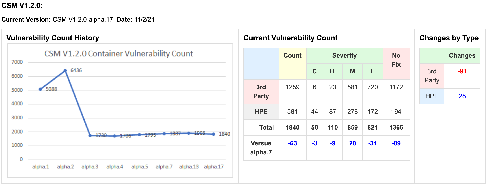
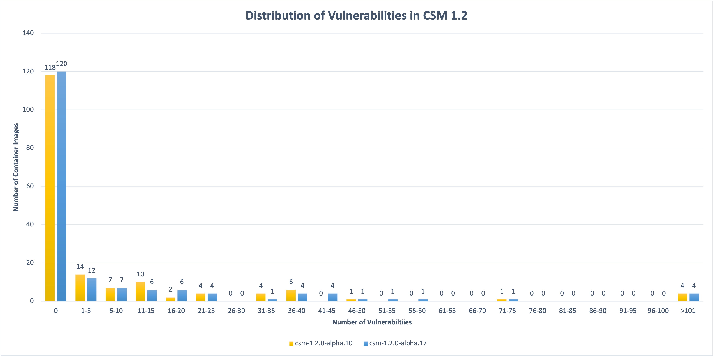

# 2021-11-10

## Status

### Container Image Vulnerabilities

Focus is on updating images in Helm charts where rebuilding is insufficient to
resolve CVEs, see [CASM-2670 (HPE
internal)](https://connect.us.cray.com/jira/browse/CASM-2670). Built GitHub
Action [workflow to lint, test, and scan Helm charts and required
images](https://github.com/Cray-HPE/.github/blob/main/.github/workflows/charts-lint-test-scan.yml)
to help development teams assess status.

Note: Aggregated Snyk results for CSM 1.2.0-alpha.17 are available at
https://artifactory.algol60.net/artifactory/releases/csm/1.2/csm-1.2.0-alpha.17-snyk-results.xlsx.
([Raw Snyk
results](https://artifactory.algol60.net/artifactory/releases/csm/1.2/csm-1.2.0-alpha.17-scans.tar.gz)
are also available.)

### API Least Privileges

Kazuya Okubo has started to look at the vulnerabilities identified with CPS and
NMD. He's engaged on #sig-csm-security.

### Non-root Containers

Work to update `users` and `capabilities` policies to account for necessary
exemptions is getting started. Not yet clear precisely what will land in CSM
1.2.

### Pen Testing

Nothing to report
