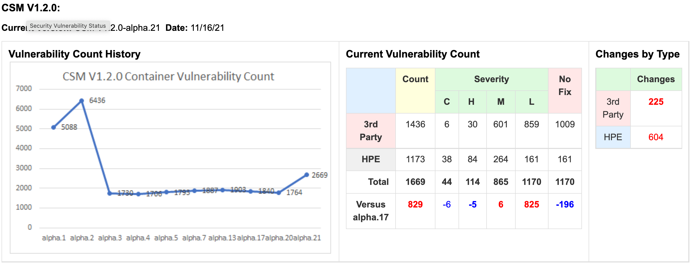

# 2021-11-10

## Status

### Container Image Vulnerabilities

Focus remains on updating images in Helm charts where rebuilding is insufficient to
resolve CVEs, see [CASM-2670 (HPE
internal)](https://connect.us.cray.com/jira/browse/CASM-2670).

As the charts below show, CSM 1.2.0-alpha.21 saw a significant increase in CVEs
for images based on busybox due to the following low vulnerabilities, all of
which should be resolvable by updating the base busybox image to 1.32.1-r7:

- [CVE-2021-42375](https://snyk.io/vuln/SNYK-ALPINE313-BUSYBOX-1920715)
- [CVE-2021-42383](https://snyk.io/vuln/SNYK-ALPINE313-BUSYBOX-1920735)
- [CVE-2021-42381](https://snyk.io/vuln/SNYK-ALPINE313-BUSYBOX-1920736)
- [CVE-2021-42380](https://snyk.io/vuln/SNYK-ALPINE313-BUSYBOX-1920742)
- [CVE-2021-42386](https://snyk.io/vuln/SNYK-ALPINE313-BUSYBOX-1920743)
- [CVE-2021-42379](https://snyk.io/vuln/SNYK-ALPINE313-BUSYBOX-1920746)
- [CVE-2021-42374](https://snyk.io/vuln/SNYK-ALPINE313-BUSYBOX-1920750)
- [CVE-2021-42382](https://snyk.io/vuln/SNYK-ALPINE313-BUSYBOX-1920751)
- [CVE-2021-42378](https://snyk.io/vuln/SNYK-ALPINE313-BUSYBOX-1920752)
- [CVE-2021-42384](https://snyk.io/vuln/SNYK-ALPINE313-BUSYBOX-1920759)
- [CVE-2021-42385](https://snyk.io/vuln/SNYK-ALPINE313-BUSYBOX-1920760)

Note: Aggregated Snyk results for CSM 1.2.0-alpha.21 are available at
https://artifactory.algol60.net/artifactory/releases/csm/1.2/csm-1.2.0-alpha.21-snyk-results.xlsx.
([Raw Snyk
results](https://artifactory.algol60.net/artifactory/releases/csm/1.2/csm-1.2.0-alpha.21-scans.tar.gz)
are also available.)

### API Least Privileges

Nothing to report

### Non-root Containers

Pushing this work to CSM 1.3.

### Pen Testing

Nothing to report
